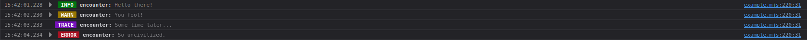
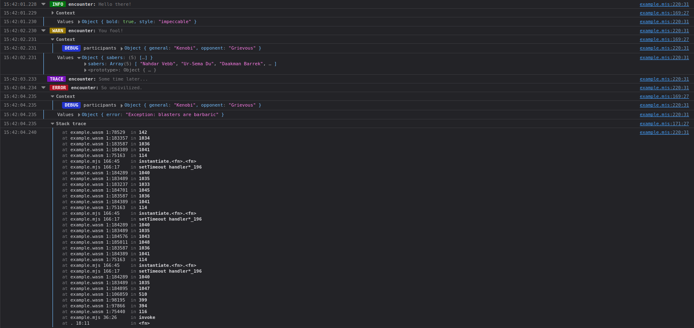

# Journal web output

An output targeting Javascript environments for [`journal`].

**Writes entries using the [`console`] APIs.**

This package only works on the web platform.
In all other environments, it simply ignores the output.

Published to [the pub.dev package registry][registry].

[`journal`]: https://pub.dev/packages/journal
[`console`]: https://developer.mozilla.org/en-US/docs/Web/API/console
[registry]: https://pub.dev/packages/journal_web

## Usage

To use this output, add it to `Journal.outputs`.

```dart
import 'package:journal/journal.dart';
import 'package:journal_web/journal_web.dart';

Journal.outputs = const [WebOutput()];
```

By default, all output is densely collapsed in the developer console.

<p align="center">
  <a target="_blank" rel="noopener noreferrer" href="doc/output-collapsed.png">
    
  </a>
</p>

If you need to inspect the details of an entry, you can simply expand it to reveal associated
values, contexts, and the stack trace, if any.

<p align="center">
  <a target="_blank" rel="noopener noreferrer" href="doc/output-expanded.png">
    
  </a>
</p>

## Release history

See the [changelog](CHANGELOG.md) for a detailed list of changes throughout the package's history.
